# AirPlay-CloudFront HLS Proxy

A proxy service that enables AirPlay streaming of HLS content protected by CloudFront signed cookies.

## Problem

CloudFront uses signed cookies for HLS authentication, but AirPlay devices only accept clean URLs without cookie support. This creates a compatibility issue when trying to stream protected HLS content to AirPlay devices like Apple TV.

## Solution

This proxy server bridges the gap by:
- Accepting CloudFront cookies and creating a session
- Providing cookieless URLs with embedded session identifiers
- Proxying all HLS requests (manifests + segments) to CloudFront with stored cookies
- Rewriting manifest URLs to route back through the proxy

## Architecture Flow

```mermaid
sequenceDiagram
    participant App as iOS App
    participant Proxy as Proxy Server
    participant AirPlay as AirPlay Device
    participant CF as CloudFront

    Note over App,CF: Session Creation
    App->>Proxy: POST /api/v1/session/create<br/>{stream_url, cookies}
    Proxy->>Proxy: Generate session_id + token<br/>Store cookies + CloudFront domain
    Proxy-->>App: {session_id, token, expires_at}
    App->>App: Construct proxy URL<br/>(domain swap + /stream/ + token)

    Note over App,CF: Start AirPlay Streaming
    App->>AirPlay: Send proxy_url (with token)

    Note over App,CF: HLS Streaming (via Proxy)
    AirPlay->>Proxy: GET /stream/master.m3u8?token=...
    Proxy->>Proxy: Validate token → lookup session
    Proxy->>CF: GET master.m3u8<br/>(with cookies)
    CF-->>Proxy: master.m3u8
    Proxy->>Proxy: Rewrite URLs with ?token=...
    Proxy-->>AirPlay: Modified master.m3u8

    AirPlay->>Proxy: GET /stream/720p/index.m3u8?token=...
    Proxy->>CF: GET 720p/index.m3u8<br/>(with cookies)
    CF-->>Proxy: index.m3u8
    Proxy->>Proxy: Rewrite segment URLs with ?token=...
    Proxy-->>AirPlay: Modified index.m3u8

    loop For each segment
        AirPlay->>Proxy: GET /stream/720p/segment001.ts?token=...
        Proxy->>CF: GET segment001.ts<br/>(with cookies)
        CF-->>Proxy: segment001.ts
        Proxy-->>AirPlay: Stream segment
    end

    Note over App,CF: Cookie Refresh (Optional)
    App->>Proxy: PUT /api/v1/session/{session_id}/refresh<br/>{new_cookies}
    Proxy->>Proxy: Update stored cookies
    Proxy-->>App: {expires_at, updated: true}
```



## URL Transformation

The proxy transforms CloudFront URLs into cookieless proxy URLs with token-based authentication:

```
Original CloudFront URLs (multiple feeds from same base):
https://cdn.example.com/content/2025/feed1_4000K.m3u8
https://cdn.example.com/content/2025/feed2_4000K.m3u8
https://cdn.example.com/content/2025/feed1_4000K/720p/segment001.ts

Proxied URLs (client constructs by replacing base URL + /stream/ prefix + token):
https://proxy.render.com/stream/feed1_4000K.m3u8?token=t_x8y9z0a1b2c3d4e5
https://proxy.render.com/stream/feed2_4000K.m3u8?token=t_x8y9z0a1b2c3d4e5
https://proxy.render.com/stream/feed1_4000K/720p/segment001.ts?token=t_x8y9z0a1b2c3d4e5
```

**Key Design:**
- Proxy URL structure mirrors CloudFront (base URL swap + `/stream/` prefix)
- Token passed as query parameter, decoupling authentication from the resource path
- Client constructs proxy URLs from original URLs + token (no need for server to return them)
- **Multiple feeds supported:** One session/token works for all feeds under the same base URL (different camera angles, audio tracks, etc.)

## API Endpoints

### Create Session
```http
POST /api/v1/session/create
Content-Type: application/json

{
  "base_url": "https://cdn.example.com/content/2025",
  "cookies": {
    "CloudFront-Policy": "eyJTdGF0ZW1lbnQiOlt...",
    "CloudFront-Signature": "abc123...",
    "CloudFront-Key-Pair-Id": "APKAXXXXX"
  },
  "ttl": 3600
}
```

**Response:**
```json
{
  "session_id": "s_a1b2c3d4e5f6",
  "token": "t_x8y9z0a1b2c3d4e5",
  "expires_at": "2025-12-07T20:30:00Z"
}
```

The `session_id` is used for management operations (refresh, delete), while the `token` is used for all streaming requests. The client constructs proxy URLs by replacing the base URL with the proxy server + `/stream/`, and appending the token.

**Multiple Feeds:** A single session/token supports multiple feeds from the same base URL (e.g., different camera angles, audio tracks, quality levels).

### Refresh Session Cookies
```http
PUT /api/v1/session/{session_id}/refresh
Content-Type: application/json

{
  "cookies": {
    "CloudFront-Policy": "eyJTdGF0ZW1lbnQiOlt...",
    "CloudFront-Signature": "new_signature...",
    "CloudFront-Key-Pair-Id": "APKAXXXXX"
  }
}
```

### Stream Content (AirPlay Device)
```http
GET /stream/{path}?token={token}
```

This endpoint is automatically called by the AirPlay device as it requests manifests and segments. The token is validated and used to look up the session containing CloudFront cookies.

### Health Check
```http
GET /health
```

## Technology Stack

- **FastAPI** - Modern Python web framework with async support
- **uvicorn** - ASGI server for production
- **httpx** - Async HTTP client for CloudFront requests
- **Pydantic** - Request/response validation

## Deployment

This service is deployed to **Render** via CI/CD pipelines using **Docker** (not docker-compose). The service automatically deploys when changes are pushed to the main branch.

### Environment Variables

Configure these in the Render dashboard:

- `ALLOWED_CLOUDFRONT_DOMAINS` - Comma-separated list of allowed CloudFront domains
- `SESSION_TTL_SECONDS` - Default session TTL (default: 3600)
- `SESSION_MAX_TTL_SECONDS` - Maximum session TTL (default: 21600)
- `SESSION_IDLE_TIMEOUT_SECONDS` - Idle timeout (default: 1800)

## Development

### Prerequisites

- Python 3.11+
- pip or poetry

### Local Setup

```bash
# Create virtual environment
python3 -m venv venv
source venv/bin/activate  # On Windows: venv\Scripts\activate

# Install dependencies
pip install -r requirements.txt

# Run development server
./run.sh
# Or manually:
uvicorn app.main:app --reload --host 0.0.0.0 --port 8000
```

### Testing

```bash
# Activate virtual environment
source venv/bin/activate

# Run all tests
pytest

# Run tests with coverage report
pytest --cov=app --cov-report=html

# Run specific test file
pytest tests/test_session_store.py -v
```

### Code Quality

```bash
# Format code
black app/ tests/

# Lint code
ruff check app/ tests/

# Type checking
mypy app/
```

## Security

- Session IDs are generated using cryptographically secure random tokens
- CloudFront cookies are validated before storage
- Path traversal protection prevents directory traversal attacks
- Session expiration and idle timeouts prevent stale sessions
- Rate limiting per session (to be implemented)

## License

MIT
